Exploration of Red Wine Quality
================
Cady Patino
May 7, 2018

> This report explores a dataset containing 11 variables of the chemical properties of red wines from the Portuguese Vinho Verde region and their corresponding quality rating. The quality rating for each wine is the median grade given by at least three wine experts and has a value between 0 (very bad) and 10 (very excellent).

Univariate Plots Section
========================

    ## 'data.frame':    1599 obs. of  13 variables:
    ##  $ X                   : int  1 2 3 4 5 6 7 8 9 10 ...
    ##  $ fixed.acidity       : num  7.4 7.8 7.8 11.2 7.4 7.4 7.9 7.3 7.8 7.5 ...
    ##  $ volatile.acidity    : num  0.7 0.88 0.76 0.28 0.7 0.66 0.6 0.65 0.58 0.5 ...
    ##  $ citric.acid         : num  0 0 0.04 0.56 0 0 0.06 0 0.02 0.36 ...
    ##  $ residual.sugar      : num  1.9 2.6 2.3 1.9 1.9 1.8 1.6 1.2 2 6.1 ...
    ##  $ chlorides           : num  0.076 0.098 0.092 0.075 0.076 0.075 0.069 0.065 0.073 0.071 ...
    ##  $ free.sulfur.dioxide : num  11 25 15 17 11 13 15 15 9 17 ...
    ##  $ total.sulfur.dioxide: num  34 67 54 60 34 40 59 21 18 102 ...
    ##  $ density             : num  0.998 0.997 0.997 0.998 0.998 ...
    ##  $ pH                  : num  3.51 3.2 3.26 3.16 3.51 3.51 3.3 3.39 3.36 3.35 ...
    ##  $ sulphates           : num  0.56 0.68 0.65 0.58 0.56 0.56 0.46 0.47 0.57 0.8 ...
    ##  $ alcohol             : num  9.4 9.8 9.8 9.8 9.4 9.4 9.4 10 9.5 10.5 ...
    ##  $ quality             : int  5 5 5 6 5 5 5 7 7 5 ...

    ##  fixed.acidity   volatile.acidity  citric.acid    residual.sugar  
    ##  Min.   : 4.60   Min.   :0.1200   Min.   :0.000   Min.   : 0.900  
    ##  1st Qu.: 7.10   1st Qu.:0.3900   1st Qu.:0.090   1st Qu.: 1.900  
    ##  Median : 7.90   Median :0.5200   Median :0.260   Median : 2.200  
    ##  Mean   : 8.32   Mean   :0.5278   Mean   :0.271   Mean   : 2.539  
    ##  3rd Qu.: 9.20   3rd Qu.:0.6400   3rd Qu.:0.420   3rd Qu.: 2.600  
    ##  Max.   :15.90   Max.   :1.5800   Max.   :1.000   Max.   :15.500  
    ##    chlorides       free.sulfur.dioxide total.sulfur.dioxide
    ##  Min.   :0.01200   Min.   : 1.00       Min.   :  6.00      
    ##  1st Qu.:0.07000   1st Qu.: 7.00       1st Qu.: 22.00      
    ##  Median :0.07900   Median :14.00       Median : 38.00      
    ##  Mean   :0.08747   Mean   :15.87       Mean   : 46.47      
    ##  3rd Qu.:0.09000   3rd Qu.:21.00       3rd Qu.: 62.00      
    ##  Max.   :0.61100   Max.   :72.00       Max.   :289.00      
    ##     density             pH          sulphates         alcohol     
    ##  Min.   :0.9901   Min.   :2.740   Min.   :0.3300   Min.   : 8.40  
    ##  1st Qu.:0.9956   1st Qu.:3.210   1st Qu.:0.5500   1st Qu.: 9.50  
    ##  Median :0.9968   Median :3.310   Median :0.6200   Median :10.20  
    ##  Mean   :0.9967   Mean   :3.311   Mean   :0.6581   Mean   :10.42  
    ##  3rd Qu.:0.9978   3rd Qu.:3.400   3rd Qu.:0.7300   3rd Qu.:11.10  
    ##  Max.   :1.0037   Max.   :4.010   Max.   :2.0000   Max.   :14.90  
    ##     quality      quality.factor
    ##  Min.   :3.000   3: 10         
    ##  1st Qu.:5.000   4: 53         
    ##  Median :6.000   5:681         
    ##  Mean   :5.636   6:638         
    ##  3rd Qu.:6.000   7:199         
    ##  Max.   :8.000   8: 18

This data set contains 1599 observations of 13 variables. The first variable, X, appears to be the index column, so I removed it from the dataset before performing the summary. The next 11 variables are numbers pertaining to the chemical properties of wine, and the final variable is the quality rating. I converted the quality rating from an integer to a factor and added it as a new variable, quality.factor. This way I can look at it in different ways in my analyses.

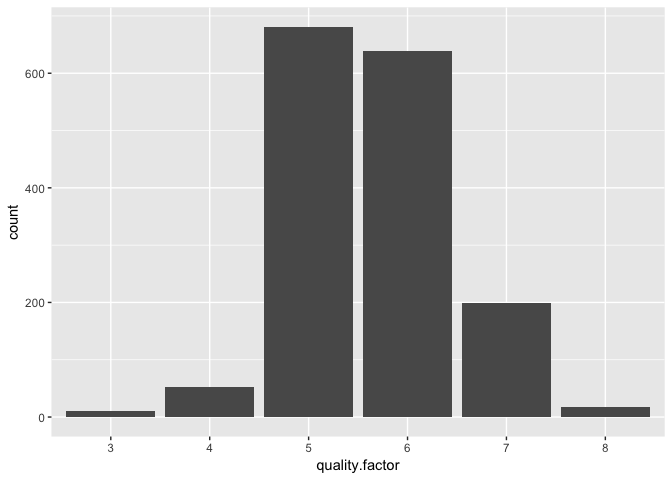

From the above plot, it is clear that all quality values in this data set are integers. The majority of quality ratings in this data set are 5 or 6, and 3 and 8 are the least common ratings.

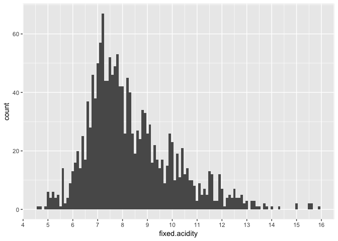

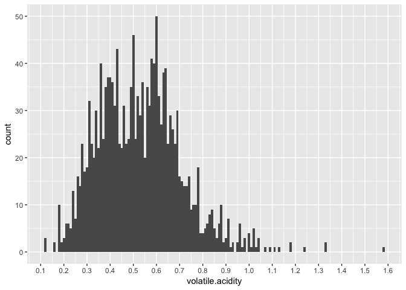

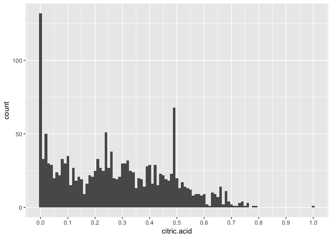

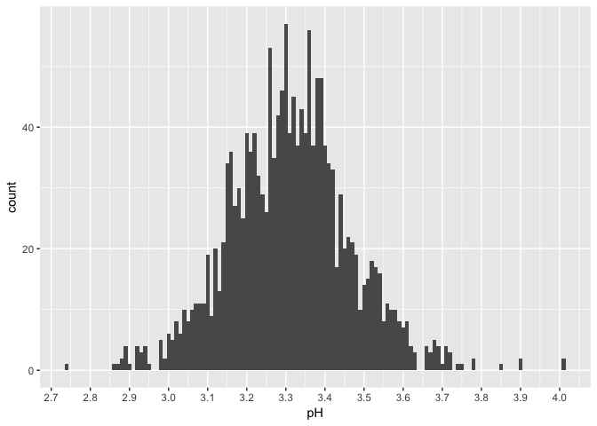

Above are the histograms related to acidity and pH. The bulk of the fixed acidity data is between 7 and 9. The bulk of the volatile acidity is between 0.3 and 0.7. These two variables follow a fairly normal distribution with some outliers on the high end. The data for citric acid, on the other hand, is much more spread out, with peaks at 0 and about 0.49. The majority of citric acid data falls between 0 and 0.5. Lastly, the plot for pH appears normally distributed with just a few outliers around 2.75 and 3.8-4.0. The bulk of the pH data falls between 3.1 and 3.5 with a peak around 3.3.

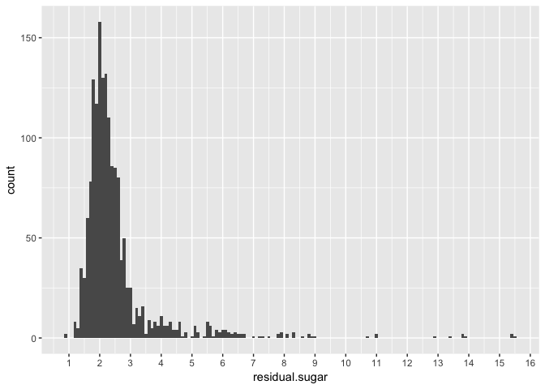

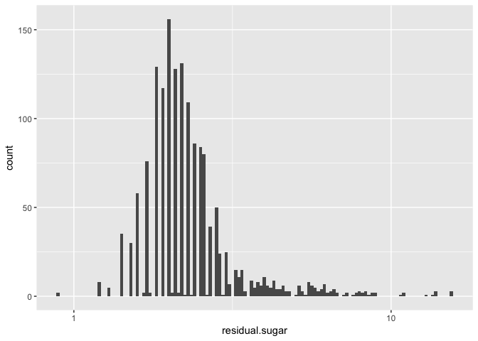

Above, I plotted histograms of residual sugar and the log transformation of residual sugar due to its long-tailed nature. The peak of the data is around 2-2.5. The transformed data still has a tail due to far outliers out to 16.

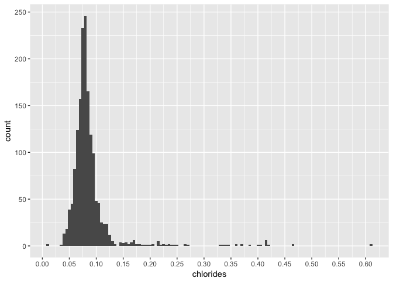

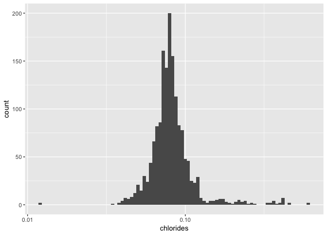

Similarly to the sugar data, I plotted histograms of the chloride data and its log transformation due to its right-skewdness and long tail. The bulk of the data is between 0.06 and 0.1, with a peak of about 0.8.

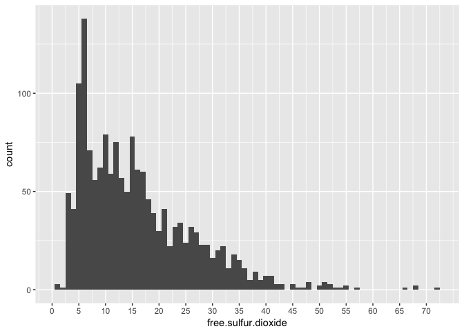

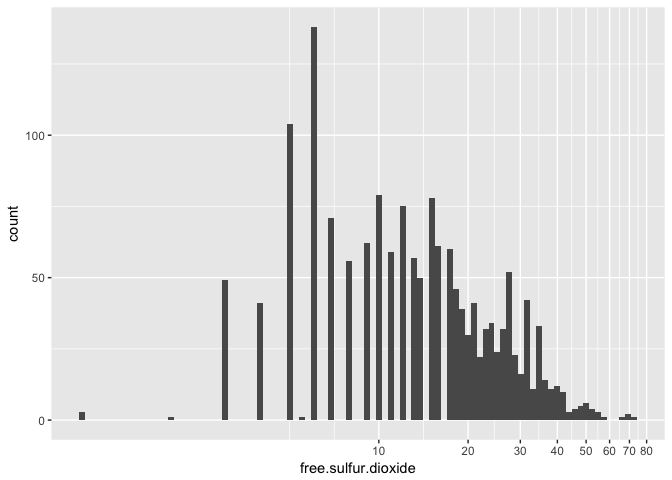

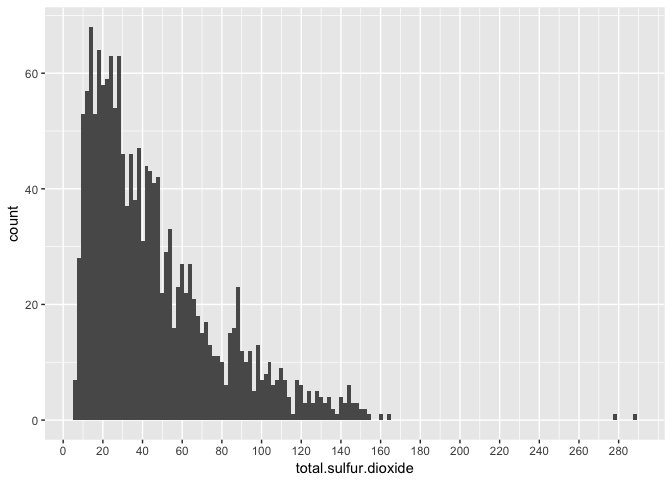

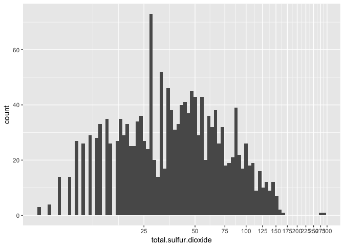

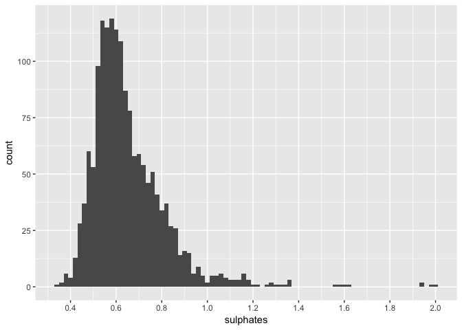

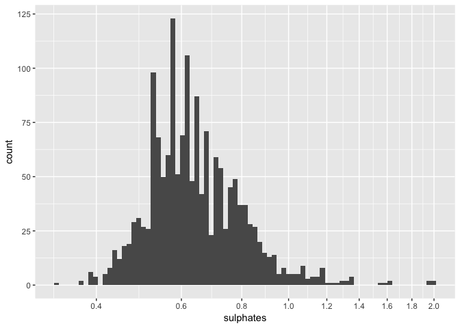

Here, I've plotted histograms of the data pertaining to sulfer dioxide and sulphates. I plotted the log transformation of each of these variables as well, since the data are right-skewed and long-tailed. For free sulfur dioxide and total sulfur dioxide, after the transformation you can see some discreteness in the left side of the graphs, and the data are fairly wide spread. For free sulfur dioxide, the bulk of the data is between 5 and 20, with a peak around 6. For total sulfur dioxide, the bulk of the data is between 15 and 75, with a peak around 30. Lastly, for sulphates (a wine additive that contributes to sulfur dioxide gas levels), the data is more narrowly distributed, with the majority of the data falling between 0.5 and 0.8. The peak for sulphates appears to be around 5.8.

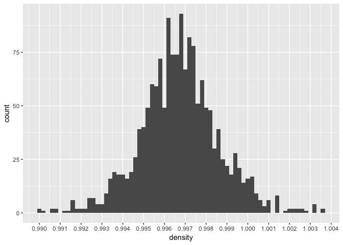

The density histogram is already normally distributed, with the majority of the data falling between 0.995 and 0.999. Practically, this means that there is very little difference in density across the different wines evaluated for this dataset. My assumption is that our mouths can't tell the difference between this very small range of densities.

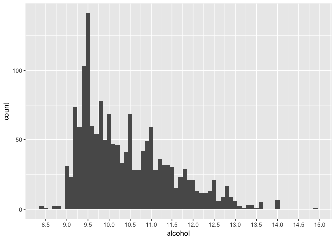

Lastly, I plotted the histogram for alcohol content. This variable has a fairly large spread. The bulk of the data is between 9.25 and 11.5, and some high outliers can be seen around 14 and about 14.8. Some low outliers can be seen as well, around 8.5. I would assume that alcohol content probably has a large affect on wine quality since alcohol content can greatly affect the taste.

I'm curious as to how each of these variables affects the quality of wine as perceived by experts. I want to now examine how these variables look for the highest quality wines (rating of 7 or 8) compared to the lowest quality wines (rating of 3 or 4) in this dataset. Note, the high quality subset has 217 samples, while the low quality subset only has 63 samples.

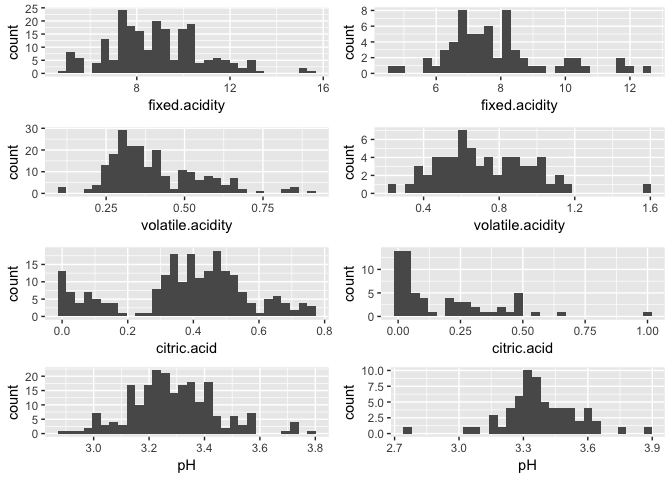

Above, I plotted the subsets of high quality (left plots) and low quality wines (right plots). Let's look at the summaries as well.

``` r
summary(high_quality$fixed.acidity)
```

    ##    Min. 1st Qu.  Median    Mean 3rd Qu.    Max. 
    ##   4.900   7.400   8.700   8.847  10.100  15.600

``` r
summary(low_quality$fixed.acidity)
```

    ##    Min. 1st Qu.  Median    Mean 3rd Qu.    Max. 
    ##   4.600   6.800   7.500   7.871   8.400  12.500

The highest quality wines (first summary) have a greater mean and median fixed acidity than the lower quality wines (second summary), as well as a higher max value.

``` r
summary(high_quality$volatile.acidity)
```

    ##    Min. 1st Qu.  Median    Mean 3rd Qu.    Max. 
    ##  0.1200  0.3000  0.3700  0.4055  0.4900  0.9150

``` r
summary(low_quality$volatile.acidity)
```

    ##    Min. 1st Qu.  Median    Mean 3rd Qu.    Max. 
    ##  0.2300  0.5650  0.6800  0.7242  0.8825  1.5800

From this summary I can see that the lowest quality wines (second) have a much higher mean and median volatile acidity than the highest quality wines (first).

``` r
summary(high_quality$citric.acid)
```

    ##    Min. 1st Qu.  Median    Mean 3rd Qu.    Max. 
    ##  0.0000  0.3000  0.4000  0.3765  0.4900  0.7600

``` r
summary(low_quality$citric.acid)
```

    ##    Min. 1st Qu.  Median    Mean 3rd Qu.    Max. 
    ##  0.0000  0.0200  0.0800  0.1737  0.2700  1.0000

The high quality subset (first) has a greater mean and median citric acid content than the low quality subset (second).

``` r
summary(high_quality$pH)
```

    ##    Min. 1st Qu.  Median    Mean 3rd Qu.    Max. 
    ##   2.880   3.200   3.270   3.289   3.380   3.780

``` r
summary(low_quality$pH)
```

    ##    Min. 1st Qu.  Median    Mean 3rd Qu.    Max. 
    ##   2.740   3.300   3.380   3.384   3.500   3.900

Interestingly, the pH summaries for the high quality (first) and low quality (second) subsets are very similar. They have similar mean and median values, with the low quality wines having just slightly greater values.

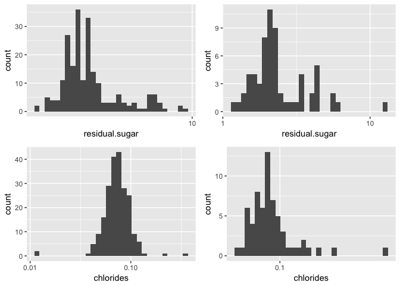

Above are the histograms for sugar and salts in the wine samples, broken up into subsets of high quality wines (left) and low quality wines (right).

``` r
summary(high_quality$residual.sugar)
```

    ##    Min. 1st Qu.  Median    Mean 3rd Qu.    Max. 
    ##   1.200   2.000   2.300   2.709   2.700   8.900

``` r
summary(low_quality$residual.sugar)
```

    ##    Min. 1st Qu.  Median    Mean 3rd Qu.    Max. 
    ##   1.200   1.900   2.100   2.685   2.950  12.900

The mean and median residual sugar content are similar for both subsets; they are just slightly higher for the high quality wines (first summary). The low quality subset (second summary) has a much higher max value, however.

``` r
summary(high_quality$chlorides)
```

    ##    Min. 1st Qu.  Median    Mean 3rd Qu.    Max. 
    ## 0.01200 0.06200 0.07300 0.07591 0.08500 0.35800

``` r
summary(low_quality$chlorides)
```

    ##    Min. 1st Qu.  Median    Mean 3rd Qu.    Max. 
    ## 0.04500 0.06850 0.08000 0.09573 0.09450 0.61000

Looking at the summary of chloride content, we can see that the lower quality wines (second) have a slightly higher median and mean than the higher quality wines (first).

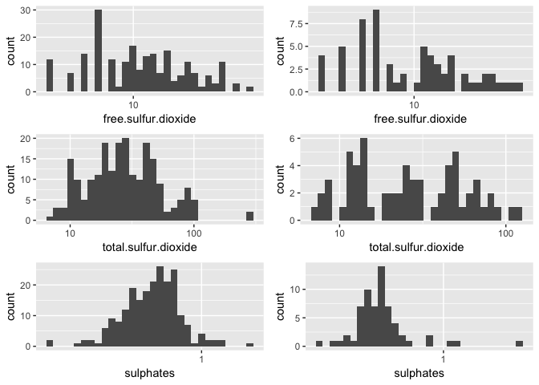

Above are the histograms for the variables relating to sulfur dioxide and sulphates, broken up into subsets of high quality wines (left) and low quality wines (right).

``` r
summary(high_quality$free.sulfur.dioxide)
```

    ##    Min. 1st Qu.  Median    Mean 3rd Qu.    Max. 
    ##    3.00    6.00   11.00   13.98   18.00   54.00

``` r
summary(low_quality$free.sulfur.dioxide)
```

    ##    Min. 1st Qu.  Median    Mean 3rd Qu.    Max. 
    ##    3.00    5.00    9.00   12.06   15.50   41.00

Here, we can see that the mean and median of free sulfur dioxide is higher in the high quality wines (first) than the low quality wines (second).

``` r
summary(high_quality$total.sulfur.dioxide)
```

    ##    Min. 1st Qu.  Median    Mean 3rd Qu.    Max. 
    ##    7.00   17.00   27.00   34.89   43.00  289.00

``` r
summary(low_quality$total.sulfur.dioxide)
```

    ##    Min. 1st Qu.  Median    Mean 3rd Qu.    Max. 
    ##    7.00   13.50   26.00   34.44   48.00  119.00

The summary above shows that the mean of total sulfur dioxide content is nearly the same for the high (first) and low (second) quality wines, but the median is slightly higher for the high quality wines.

``` r
summary(high_quality$sulphates)
```

    ##    Min. 1st Qu.  Median    Mean 3rd Qu.    Max. 
    ##  0.3900  0.6500  0.7400  0.7435  0.8200  1.3600

``` r
summary(low_quality$sulphates)
```

    ##    Min. 1st Qu.  Median    Mean 3rd Qu.    Max. 
    ##  0.3300  0.4950  0.5600  0.5922  0.6000  2.0000

And lastly in regards to sulfur dioxide and sulphates, this summary shows that the high quality wines (first) have a higher mean and median sulphate concentration than the low quality wines (second).

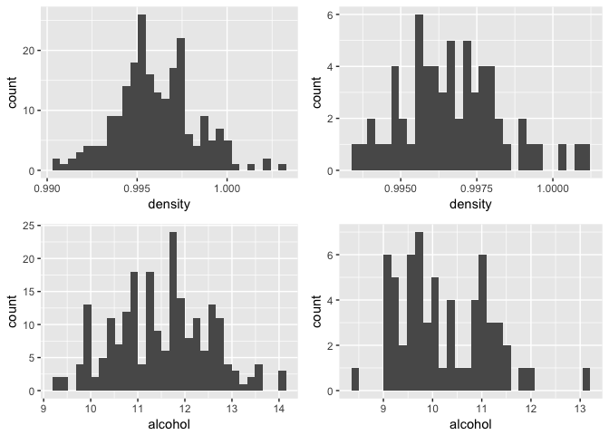

Above is our last set of histogram plots of the high quality wines (left) compared to the low quality wines (right), this time for density and alcohol content.

``` r
summary(high_quality$density)
```

    ##    Min. 1st Qu.  Median    Mean 3rd Qu.    Max. 
    ##  0.9906  0.9947  0.9957  0.9960  0.9973  1.0032

``` r
summary(low_quality$density)
```

    ##    Min. 1st Qu.  Median    Mean 3rd Qu.    Max. 
    ##  0.9934  0.9957  0.9966  0.9967  0.9977  1.0010

The mean and median densities of the hiqh quality (first) and low quality (second) wines are practically the same, with the low quality wines having only a slightly greater density.

    ##    Min. 1st Qu.  Median    Mean 3rd Qu.    Max. 
    ##    9.20   10.80   11.60   11.52   12.20   14.00

    ##    Min. 1st Qu.  Median    Mean 3rd Qu.    Max. 
    ##    8.40    9.60   10.00   10.22   11.00   13.10

This last summary shows that the mean and median of alcohol content are greater for the high quality wines (first) than the low quality wines (second).

Univariate Analysis
===================

### What is the structure of your dataset?

There are 1599 observations in this dataset with 12 features of wine: fixed acidity, volatile acidity, citric acid, residual sugar, chlorides, free sulfur dioxide, total sulfur dioxide, density, pH, sulphates, alcohol, and quality. The quality variable is of type integer (but I added a quality factor variable as well) and the rest are of type numeric.

Other observations:

-   The median quality rating is 6, and the range is from 3 to 8. Most wines have a quality rating of 5 or 6, and 25% of wines have a quality rating above 6.
-   Most wines have a fixed acidity between 7 and 9, and a volatile acidity of 0.3-0.7.
-   Citric acid concentration tends to be wide spread, with the majority between 0 and 0.5 and a median of of 0.26.
-   The mean and median pH is 3.31. Most wines have a pH between 3.1 and 3.5.
-   Most wines have a residual sugar content between 2 and 2.5 and a chloride concentration between 0.06 and 0.1.
-   Free sulfur dioxide and total sulfur dioxide are also widespread, with the majority of wines falling in the range of 5-20, and 15-75 respectively. Median free sulfur dioxide is 14 and median total sulfur dioxide is 38.
-   Most wines have a sulphate concentration between 0.5 and 0.8.
-   The median alcohol content is 10.2, with most wines having alcohol content between 9.25 and 11.5.
-   Density has a very narrow range (~0.01) with a median of 0.9968.

### What is/are the main feature(s) of interest in your dataset?

The main feature of interest in this dataset is quality. I'm interested in seeing how the chemical properties of wine affect the quality rating of wine given by experts.

### What other features in the dataset do you think will help support your investigation into your feature(s) of interest?

I think the features of fixed acidity, volatile acidity, citric acid, chlorides, free sulfur dioxide, sulphates, and alcohol are most likely to affect the quality of wine, based on my initial comparisons of high quality wines (7 or 8) vs. low quality wines (3 or 4). My guess is that volatile acidity, citric acid content, sulfur dioxide content, and alcohol will have the greatest affect on quality because these properties tend to directly alter taste and smell.

### Did you create any new variables from existing variables in the dataset?

I created a quality factor variable that is the same as quality but is of the type factor instead of integer.

### Of the features you investigated, were there any unusual distributions? Did you perform any operations on the data to tidy, adjust, or change the form of the data? If so, why did you do this?

The distributions for residual sugar, chlorides, and sulphates were originally long-tailed on the right, and the distributions for free sulfur dioxide and total sulfur dioxide were skewed to the right. I decided to log-transform these distributions so that they would more closely resemble that of a normal distribution.

The data loaded in was already tidy and in the form that I wanted. After plotting initial histograms, I created two subsets of the data by selecting only the highest quality wines (quality rating of 7 or 8) and the lowest quality wines (quality rating of 3 or 4) from the original dataset and comparing their distributions and summaries for each feature.

Bivariate Plots Section
=======================

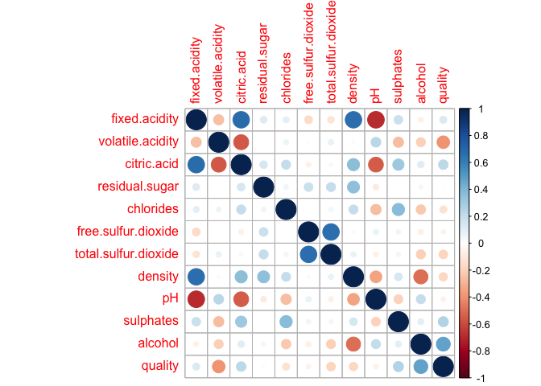

Above is a correlation matrix of the continuous variables of the dataset. Some strong correlations that were expected are fixed acidity vs. citric acid, fixed acidity vs. pH, and citric acid vs. pH. In addition, free sulfur dioxide and total sulfur dioxide have a strong correlation which makes sense because total sulfur dioxide is the total of free and bound sulfur dioxide. Surpringly, sulphate concentration is not correlated with free or total sulfur dioxide in this dataset; I expected these to be correlated because sulphates are a wine additive that can contribute to sulfur dioxide gas levels. Density appears to be moderately correlated with alcohol and fixed acidity. Lastly, citric acid has a negative correlation with volatile acidity, which I did not expect.

In regards to the feature of interest, it appears that alcohol and volatile acidity have the highest correlation to quality, followed by citric acid and sulphates.

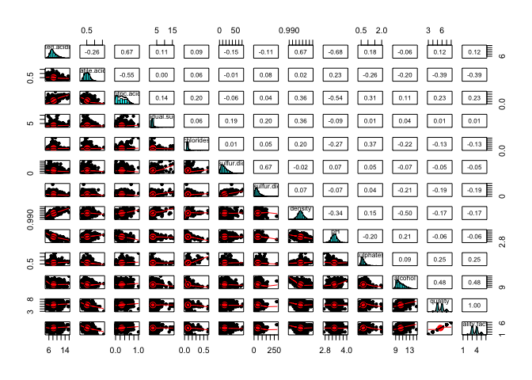

This scatterplot matrix shows pairwise relationships between all the variables in the dataset, providing an additional visualization of the correlations and corresponding correlation coefficients. Here we can again see that quality is most correlated with volatile acidity and alcohol, followed by sulphates and citric acid. I now want to take a closer look at these relationships as well as the correlation between some of the supporting variables mentioned above.

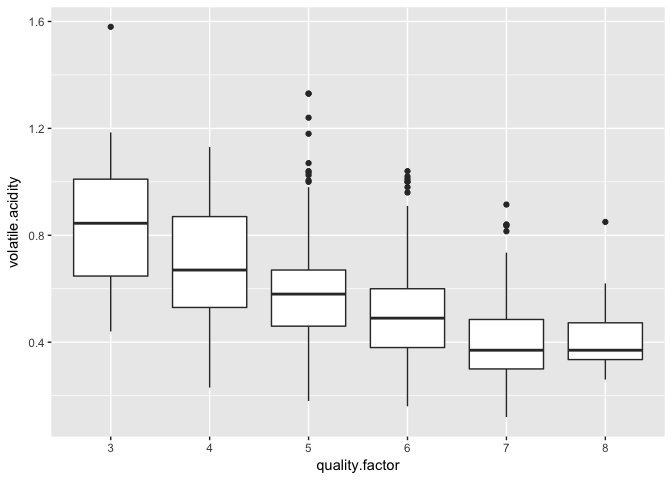

``` r
# summarize grouped by quality factor
tapply(wine$volatile.acidity, wine$quality.factor, summary)
```

    ## $`3`
    ##    Min. 1st Qu.  Median    Mean 3rd Qu.    Max. 
    ##  0.4400  0.6475  0.8450  0.8845  1.0100  1.5800 
    ## 
    ## $`4`
    ##    Min. 1st Qu.  Median    Mean 3rd Qu.    Max. 
    ##   0.230   0.530   0.670   0.694   0.870   1.130 
    ## 
    ## $`5`
    ##    Min. 1st Qu.  Median    Mean 3rd Qu.    Max. 
    ##   0.180   0.460   0.580   0.577   0.670   1.330 
    ## 
    ## $`6`
    ##    Min. 1st Qu.  Median    Mean 3rd Qu.    Max. 
    ##  0.1600  0.3800  0.4900  0.4975  0.6000  1.0400 
    ## 
    ## $`7`
    ##    Min. 1st Qu.  Median    Mean 3rd Qu.    Max. 
    ##  0.1200  0.3000  0.3700  0.4039  0.4850  0.9150 
    ## 
    ## $`8`
    ##    Min. 1st Qu.  Median    Mean 3rd Qu.    Max. 
    ##  0.2600  0.3350  0.3700  0.4233  0.4725  0.8500

Quality of wine tends to increase with decreasing volatile acidity values. The lowest quality ratings (3 and 4) have the highest median volatile acidity values and the largest interquartile ranges.

``` r
# create buckets for volatile acidity
wine$volatile.acidity.bucket <- cut(wine$volatile.acidity, 
                                    c(0, 0.3, 0.4, 0.6, 0.8, 1.58))

# show table summary
table(wine$volatile.acidity.bucket)
```

    ## 
    ##    (0,0.3]  (0.3,0.4]  (0.4,0.6]  (0.6,0.8] (0.8,1.58] 
    ##        143        302        650        400        104

Above is the table summary for the volatile acidity bucket variable I created. I can now look at the density plot of quality by volatile acidity bucket.

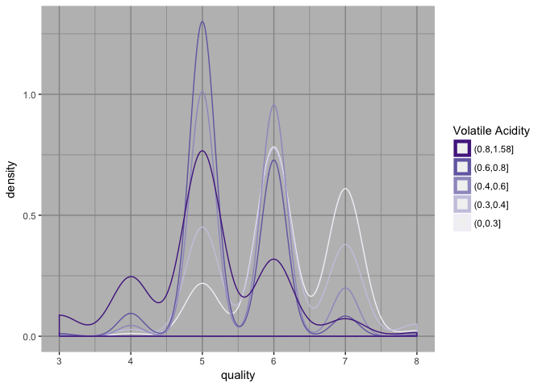

Here, the density plot shows that wines with low volatile acidity tend to occur most often with high quality ratings, and wines with high volatile acidity tend to occur most often with lower quality ratings.

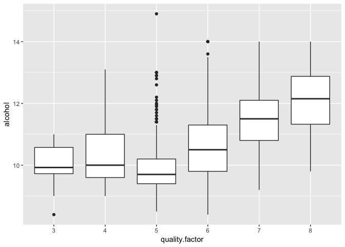

``` r
# summarize grouped by quality factor
tapply(wine$alcohol, wine$quality.factor, summary)
```

    ## $`3`
    ##    Min. 1st Qu.  Median    Mean 3rd Qu.    Max. 
    ##   8.400   9.725   9.925   9.955  10.575  11.000 
    ## 
    ## $`4`
    ##    Min. 1st Qu.  Median    Mean 3rd Qu.    Max. 
    ##    9.00    9.60   10.00   10.27   11.00   13.10 
    ## 
    ## $`5`
    ##    Min. 1st Qu.  Median    Mean 3rd Qu.    Max. 
    ##     8.5     9.4     9.7     9.9    10.2    14.9 
    ## 
    ## $`6`
    ##    Min. 1st Qu.  Median    Mean 3rd Qu.    Max. 
    ##    8.40    9.80   10.50   10.63   11.30   14.00 
    ## 
    ## $`7`
    ##    Min. 1st Qu.  Median    Mean 3rd Qu.    Max. 
    ##    9.20   10.80   11.50   11.47   12.10   14.00 
    ## 
    ## $`8`
    ##    Min. 1st Qu.  Median    Mean 3rd Qu.    Max. 
    ##    9.80   11.32   12.15   12.09   12.88   14.00

Higher quality wines tend to have higher alcohol contents. The group with quality 5 is the exception to this trend, and has the highest max value and the most outliers.

``` r
#create buckets for alcohol content
wine$alcohol.bucket <- cut(wine$alcohol, 
                           breaks=c(8, 9.25, 10, 11, 12.25, 15))

# show table summary
table(wine$alcohol.bucket)
```

    ## 
    ##  (8,9.25] (9.25,10]   (10,11] (11,12.2] (12.2,15] 
    ##       135       612       444       292       116

Above is the table summary for the alcohol bucket variable I created. I can now look at a density plot of quality by alcohol range.

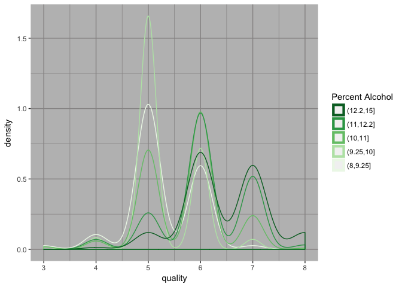

From the density plot above, we can see that high-alcohol wines tend to occur most often at high quality ratings (6 or higher) and low-alcohol wines tend to occur most often at low quality ratings (5 or below).

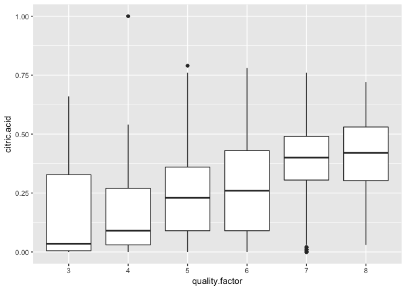

``` r
# summarize grouped by quality factor
tapply(wine$citric.acid, wine$quality.factor, summary)
```

    ## $`3`
    ##    Min. 1st Qu.  Median    Mean 3rd Qu.    Max. 
    ##  0.0000  0.0050  0.0350  0.1710  0.3275  0.6600 
    ## 
    ## $`4`
    ##    Min. 1st Qu.  Median    Mean 3rd Qu.    Max. 
    ##  0.0000  0.0300  0.0900  0.1742  0.2700  1.0000 
    ## 
    ## $`5`
    ##    Min. 1st Qu.  Median    Mean 3rd Qu.    Max. 
    ##  0.0000  0.0900  0.2300  0.2437  0.3600  0.7900 
    ## 
    ## $`6`
    ##    Min. 1st Qu.  Median    Mean 3rd Qu.    Max. 
    ##  0.0000  0.0900  0.2600  0.2738  0.4300  0.7800 
    ## 
    ## $`7`
    ##    Min. 1st Qu.  Median    Mean 3rd Qu.    Max. 
    ##  0.0000  0.3050  0.4000  0.3752  0.4900  0.7600 
    ## 
    ## $`8`
    ##    Min. 1st Qu.  Median    Mean 3rd Qu.    Max. 
    ##  0.0300  0.3025  0.4200  0.3911  0.5300  0.7200

Median citric acid concentration increases as quality increases. Citric acid can add freshness and flavor to wines, so it makes sense that using it as an additive can increase the perceived quality of the wine.

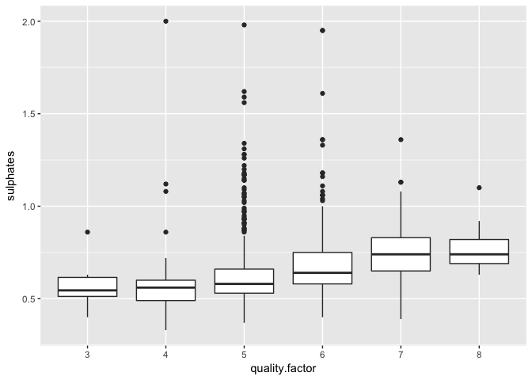 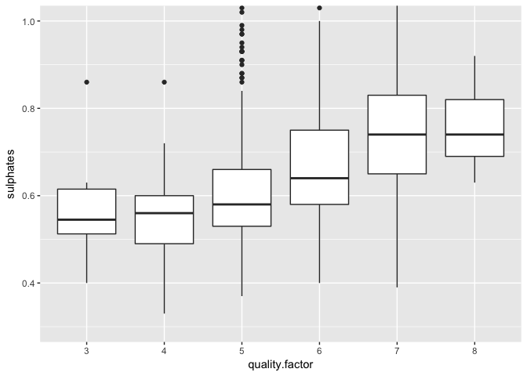

``` r
# summarize grouped by quality factor
tapply(wine$sulphates, wine$quality.factor, summary)
```

    ## $`3`
    ##    Min. 1st Qu.  Median    Mean 3rd Qu.    Max. 
    ##  0.4000  0.5125  0.5450  0.5700  0.6150  0.8600 
    ## 
    ## $`4`
    ##    Min. 1st Qu.  Median    Mean 3rd Qu.    Max. 
    ##  0.3300  0.4900  0.5600  0.5964  0.6000  2.0000 
    ## 
    ## $`5`
    ##    Min. 1st Qu.  Median    Mean 3rd Qu.    Max. 
    ##   0.370   0.530   0.580   0.621   0.660   1.980 
    ## 
    ## $`6`
    ##    Min. 1st Qu.  Median    Mean 3rd Qu.    Max. 
    ##  0.4000  0.5800  0.6400  0.6753  0.7500  1.9500 
    ## 
    ## $`7`
    ##    Min. 1st Qu.  Median    Mean 3rd Qu.    Max. 
    ##  0.3900  0.6500  0.7400  0.7413  0.8300  1.3600 
    ## 
    ## $`8`
    ##    Min. 1st Qu.  Median    Mean 3rd Qu.    Max. 
    ##  0.6300  0.6900  0.7400  0.7678  0.8200  1.1000

The quality rating of wine tends to increase with increasing sulphate levels. The median sulphate levels are higher in the highest rated wines than in the lowest rated wines. Potassium sulphate is a wine additive that can contribute to sulfur dioxide gas levels, which helps to prevent oxidation and to maintain a wine's freshness. Since sulphates seem to have an effect on quality, let's also look at the relationship between total sulfur dioxide and quality.

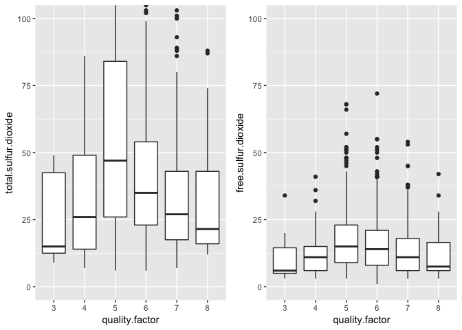

Interestingly, free and total sulfur dioxide levels do not appear to affect the quality of wine, despite the fact that sulphates do. This goes against my intuition since sulphates contribute to sulfur dioxide levels, and sulfur dioxide levels can become evident in the taste of wine. However, the dataset information does state that free sulfur dioxide levels below 50ppm are generally undetected by the nose and taste. The majority of wines at all quality levels have a free sulfur dioxide level below this threshold.

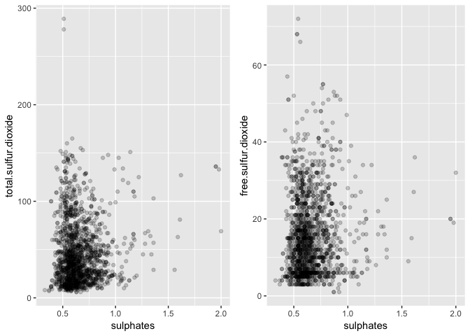

Again, it comes as a bit of a surprise that neither free or total sulfur dioxide is correlated to sulphates as shown above. After doing some more research however, I found that the alcohol fermentation process produces sulfur dioxide in amounts ranging from 10 to over 100 ppm ([source](https://winobrothers.com/2011/10/11/sulfur-dioxide-so2-in-wine/)). Therefore, even in wines without a sulphate additive, sulfur dioxide exists.

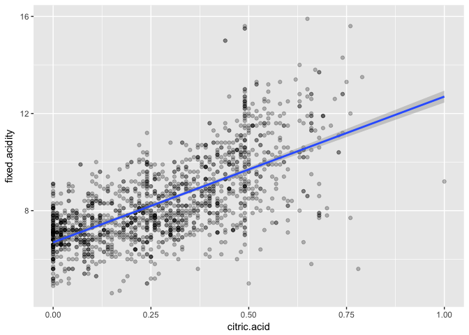

Citric acid has a positive correlation with fixed acidity that appears to be linear. This is logical since citric acid would contribute to the overall acidity of the wine. I wonder how the ratio of citric acid to total overall fixed acidity relates to quality.

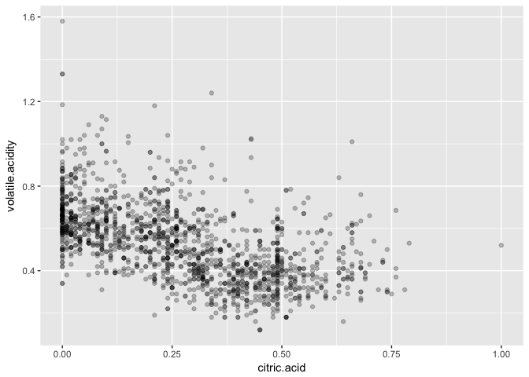

Citric acid also appears to have a correlation with volatile acidity. However, unlike with fixed acidity, this is an inverse relationship, and is not quite linear. According to the dataset information page, volatile acidity is the measure of acetic acid which evaporates readily. I wonder why citric acid would affect this feature inversely.

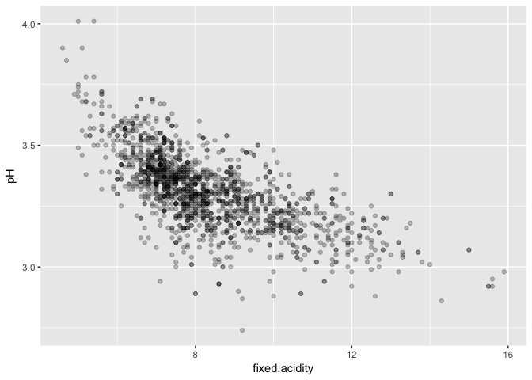

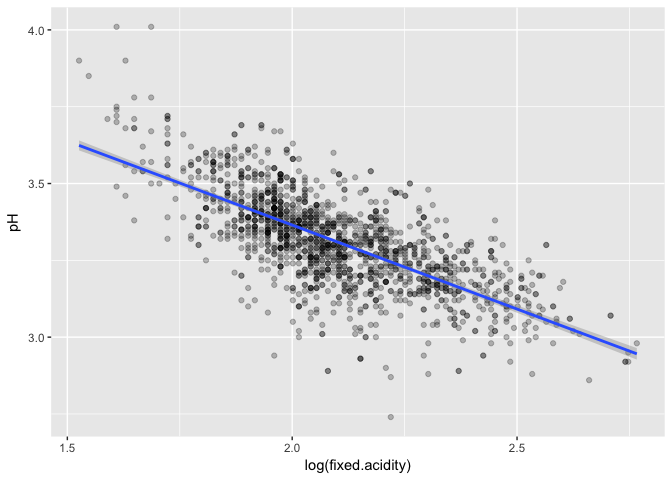

As intuition would suggest, we can see that pH decreases as fixed acidity increases. When plotting pH against the log of fixed acidity, this relationship appears linear.

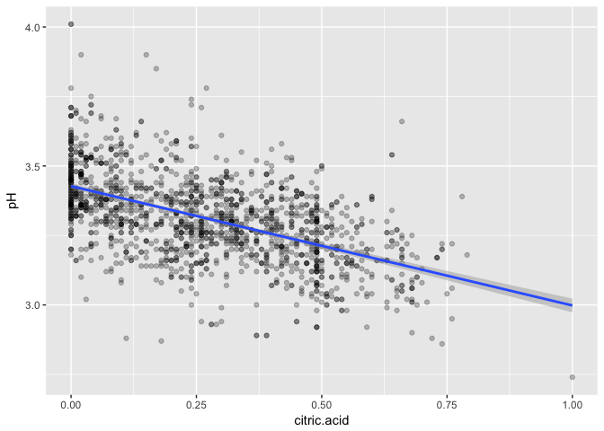

A similar relationship can be seen between pH and citric acid above.

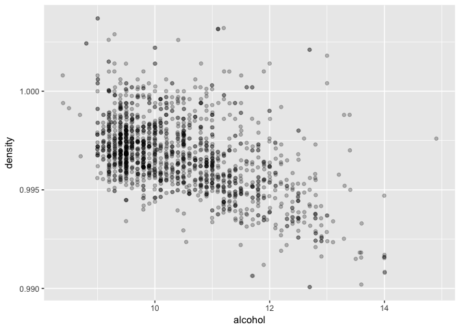

As alcohol content increases, density appears to decrease. However, these density ranges are miniscule and are most likely undetectable, which is why we can conclude it is the alcohol itself affecting quality and not the slight differences in density.

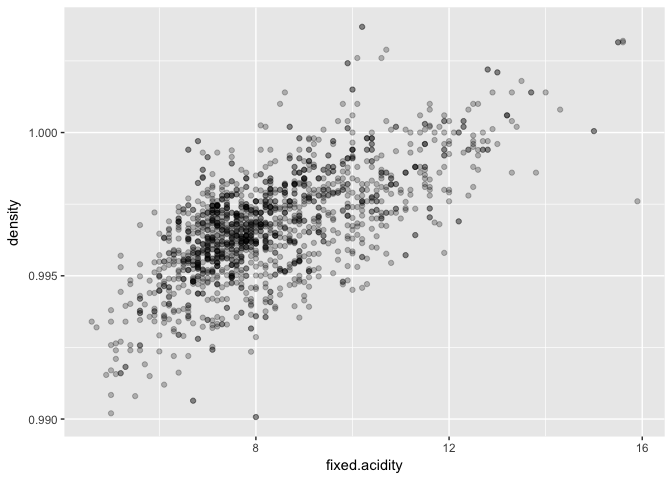

Fixed acidity has the opposite effect on density as alcohol does. As fixed acidity increases, density increases slightly. I am curious as to why this occurs.

Bivariate Analysis
==================

### Talk about some of the relationships you observed in this part of the investigation. How did the feature(s) of interest vary with other features in the dataset?

I found that quality increases as volatile acidity (acetic acid) decreases. With a correlation coefficient of 0.39, this can be considered a weak to moderate correlation. This effect is intuitive since high amounts of acetic acid in wine can lead to an unpleasant vinegar taste.

In addition, higher quality wines are associated with higher alcohol contents. Alcohol content explains the largest percentage of variance in wine quality, with a correlation coefficient of 0.48.

Citric acid levels and sulphate levels also appeared to have a positive effect on quality, although these correlations were weaker (0.23 and 0.25 respectively). Sulfur dioxide levels, however, do not appear to affect quality, at least in the range measured in this dataset, despite the fact that sulfur dioxide gas is a byproduct of sulphates.

### Did you observe any interesting relationships between the other features (not the main feature(s) of interest)?

One interesting relationship that I did not expect was the inverse relationship between citric acid and volatile acidity (acetic acid concentration). From doing some research, I found that during the malolatic fermentation process (which is sometimes performed after the primary fermentation process in Vinho Verde wines ([source](https://communitytable.parade.com/617445/allieandmeluncorked/spotlight-on-vinho-verde-10-things-to-know-about-portugals-biggest-wine-region/)), the metabolism of citric acid occurs; the citric-sugar co-metabolism can increase the formation of volatile acid in wine ([source](http://wineserver.ucdavis.edu/industry/enology/methods_and_techniques/reagents/citric_acid.html)). From this information I would assume a positive relationship would exist between citric acid and volatile acidity.

Another interesting, unexpected relationship is the positive relationship between fixed acidity and density. I am not sure why this occurs.

Lastly, I expected that sulphates would have a positive correlation to free or total suflur dioxide levels since sulfur dioxide is a byproduct. However, there was no apparent relationship between these variables, suggesting that the sulfur dioxide levels produced by fermentation probably overshadows those produced by sulphates in many cases.

### What was the strongest relationship you found?

The strongest relationship I found was that of fixed acidity and pH, with a correlation coefficient of 0.68 (strong). The strongest relationship I found regarding the main feature of interest, quality, was quality vs. alcohol content with a correlation coefficient of 0.48 (moderate).

Multivariate Plots Section
==========================

Based on what I found above, I first want to look at the effects of volatile acidity and alcohol together with quality.

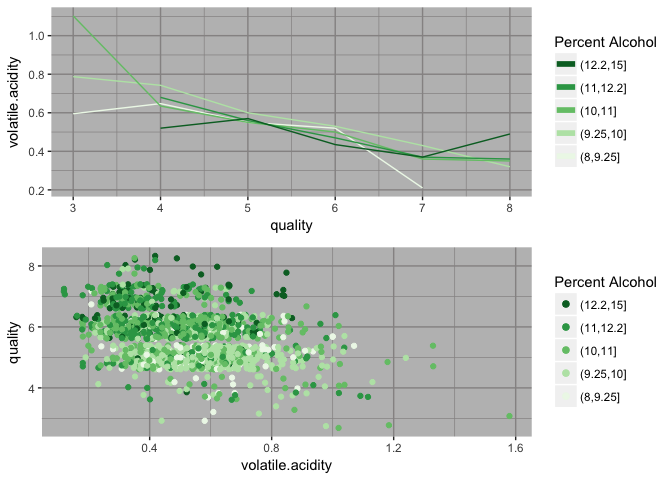

Interestingly, wines in the highest alcohol bucket are the only ones that do not follow the trend of increasing quality with decreasing volatile acidity. Additionally, no wines in the two highest alcohol buckets had a quality rating of 3 and no wines in the lowest alcohol bucket had a quality rating of 8.

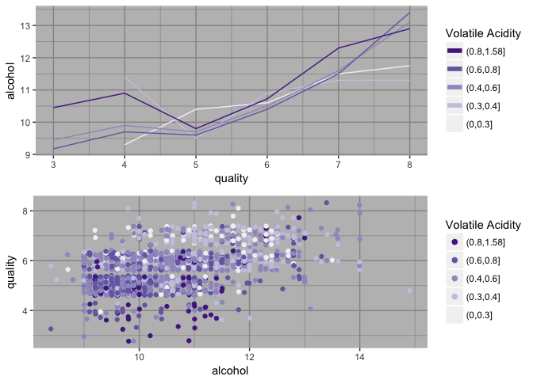

No wines in the lowest volatile acidity bucket had a quality rating of 3, but all volatile acidity buckets have some wines with a quality rating of 8. For the higher quality ratings, the higher volatile acidity buckets are associated with higher alcohol contents. Perhaps higher alcohol percentages help to compensate for any vinegar taste from high volatile acidity concentrations.

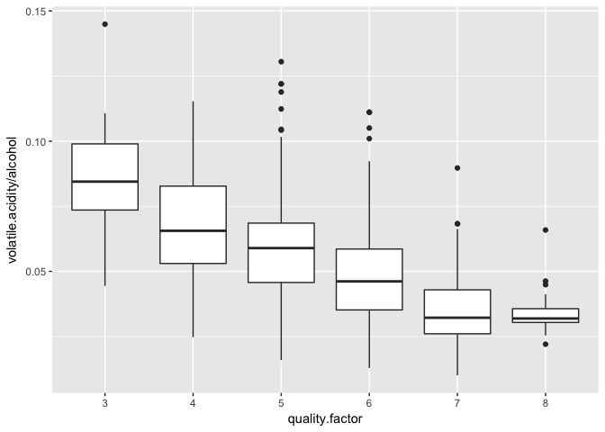

``` r
# create new variable of volatile acidity to alcohol ratio 
wine$volatile.acidity.alcohol.ratio <- wine$volatile.acidity / wine$alcohol

# summarize grouped by quality factor
tapply(wine$volatile.acidity.alcohol.ratio, wine$quality.factor, summary)
```

    ## $`3`
    ##    Min. 1st Qu.  Median    Mean 3rd Qu.    Max. 
    ## 0.04444 0.07356 0.08447 0.08763 0.09896 0.14495 
    ## 
    ## $`4`
    ##    Min. 1st Qu.  Median    Mean 3rd Qu.    Max. 
    ## 0.02473 0.05304 0.06559 0.06795 0.08274 0.11531 
    ## 
    ## $`5`
    ##    Min. 1st Qu.  Median    Mean 3rd Qu.    Max. 
    ## 0.01593 0.04574 0.05895 0.05859 0.06853 0.13053 
    ## 
    ## $`6`
    ##    Min. 1st Qu.  Median    Mean 3rd Qu.    Max. 
    ## 0.01290 0.03520 0.04616 0.04740 0.05859 0.11111 
    ## 
    ## $`7`
    ##    Min. 1st Qu.  Median    Mean 3rd Qu.    Max. 
    ## 0.01008 0.02604 0.03220 0.03547 0.04292 0.08971 
    ## 
    ## $`8`
    ##    Min. 1st Qu.  Median    Mean 3rd Qu.    Max. 
    ## 0.02203 0.03039 0.03191 0.03473 0.03567 0.06589

I wanted to see what the trend would be if I normalized volatile acidity with alcohol content. I expected this to be more level across the different quality ratings since it seems that some high alcohol wines can still be high quality with high volatile acidity. However, from the boxplot and summary above, the median of volatile acidity to alcohol decreases as quality increases (with similar values between 7 and 8), and the interquartile range decreases with increasing quality as well.

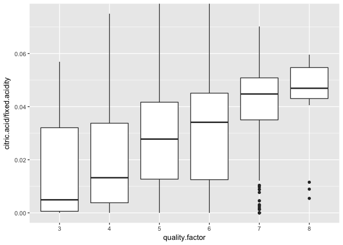

``` r
# create new variable of citric acid to fixed acidity ratio 
wine$citric.acid.fixed.acidity.ratio <- wine$citric.acid / wine$fixed.acidity

# summarize grouped by quality factor
tapply(wine$citric.acid.fixed.acidity.ratio, wine$quality.factor, summary)
```

    ## $`3`
    ##      Min.   1st Qu.    Median      Mean   3rd Qu.      Max. 
    ## 0.0000000 0.0006024 0.0049172 0.0163683 0.0320490 0.0568965 
    ## 
    ## $`4`
    ##     Min.  1st Qu.   Median     Mean  3rd Qu.     Max. 
    ## 0.000000 0.003797 0.013235 0.020776 0.033750 0.108696 
    ## 
    ## $`5`
    ##    Min. 1st Qu.  Median    Mean 3rd Qu.    Max. 
    ## 0.00000 0.01270 0.02778 0.02844 0.04167 0.09870 
    ## 
    ## $`6`
    ##    Min. 1st Qu.  Median    Mean 3rd Qu.    Max. 
    ## 0.00000 0.01250 0.03411 0.03112 0.04507 0.13929 
    ## 
    ## $`7`
    ##    Min. 1st Qu.  Median    Mean 3rd Qu.    Max. 
    ## 0.00000 0.03502 0.04476 0.04050 0.05083 0.08831 
    ## 
    ## $`8`
    ##     Min.  1st Qu.   Median     Mean  3rd Qu.     Max. 
    ## 0.005455 0.043042 0.046917 0.043204 0.054709 0.059574

Above, I plotted the ratio of citric acid to fixed acidity to see how it affects quality, and then displayed the summary of this ratio grouped by quality factor. This essentially normalizes the citric acid to the total amount of acids contributing to overall fixed acidity in the wine. We can see that the median ratio increases with increasing quality ratings, in a more linear fashion than the plot of citric acid alone.

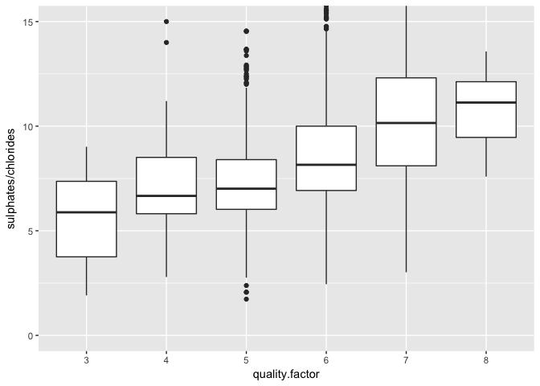

``` r
# create new variable of sulphates to chloride ratio
wine$sulphates.chloride.ratio <- wine$sulphates / wine$chlorides

# calculate correlation coefficient with quality
cor(wine$quality, wine$sulphates.chloride.ratio, method = 'pearson')
```

    ## [1] 0.3642651

``` r
# summarize grouped by quality factor
tapply(wine$sulphates.chloride.ratio, wine$quality.factor, summary)
```

    ## $`3`
    ##    Min. 1st Qu.  Median    Mean 3rd Qu.    Max. 
    ##   1.910   3.754   5.882   5.645   7.362   9.016 
    ## 
    ## $`4`
    ##    Min. 1st Qu.  Median    Mean 3rd Qu.    Max. 
    ##   2.791   5.814   6.667   7.374   8.507  15.000 
    ## 
    ## $`5`
    ##    Min. 1st Qu.  Median    Mean 3rd Qu.    Max. 
    ##   1.731   6.024   7.011   7.349   8.400  30.566 
    ## 
    ## $`6`
    ##    Min. 1st Qu.  Median    Mean 3rd Qu.    Max. 
    ##   2.448   6.926   8.154   8.694  10.000  22.051 
    ## 
    ## $`7`
    ##    Min. 1st Qu.  Median    Mean 3rd Qu.    Max. 
    ##   3.017   8.105  10.152  10.653  12.310  32.500 
    ## 
    ## $`8`
    ##    Min. 1st Qu.  Median    Mean 3rd Qu.    Max. 
    ##   7.590   9.463  11.129  11.684  12.125  18.636

I decided to look at how the sulphate to chloride ratio affects quality of wine by creating a sulphates to chlorides ratio variable in the dataset. From research I found that some brewers believe the sulphate to chloride ratio is more important than the individual amounts themselves ([source](https://www.homebrewtalk.com/forum/threads/sulfate-to-chloride-ratio.526109/)) - this is generally discussed for beers but I decided to look at it for wines too. We can see from the summary above that the sulphate to chloride ratio does appear to affect quality in a linear fashion - higher quality wines have higher median ratios. The correlation coefficient of this ratio vs. quality is 0.36, which is higher than with sulphates alone.

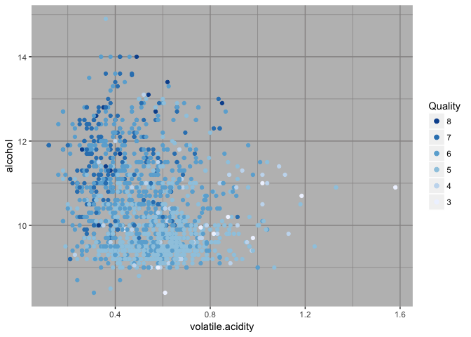

The plot above is another visualization showing that the higher quality wines are seen most at high alcohol content and low volatile acidity.

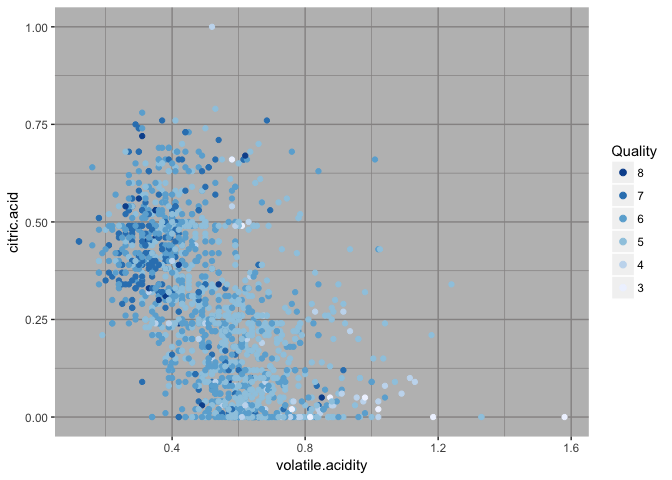

Here, we can see more high-quality wines at high citric acid contents and low volatile acidity. The linear relationship between citric acid and volatile acidity can also be seen again in this plot.

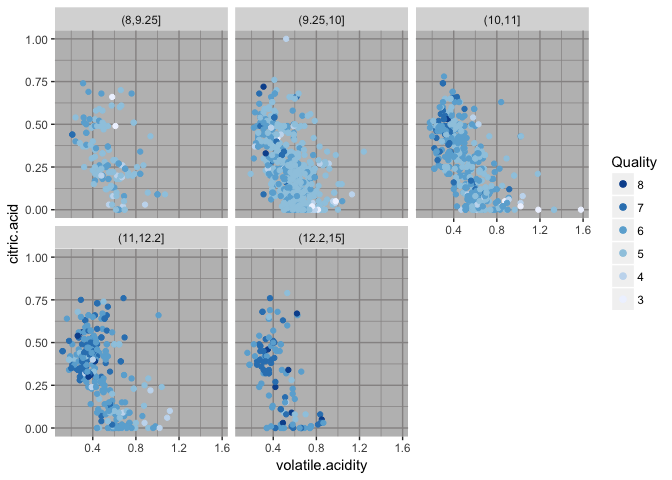

When citric acid vs. volatile acidity is faceted over alcohol ranges, it appears that for the lower alcohol ranges, the higher qualities are seen at low volatile acidity and high citric acid concentration. For the higher alcohol ranges, the high quality wines are seen across a wider range of citric acid and volatile acidity values.

Based on the correlations between quality and some of these variables, I now want to create a linear model to explain some of the variance in quality across red wines.

    ## 
    ## Calls:
    ## m1: lm(formula = quality ~ alcohol, data = wine)
    ## m2: lm(formula = quality ~ alcohol + volatile.acidity, data = wine)
    ## m3: lm(formula = quality ~ alcohol + volatile.acidity + sulphates, 
    ##     data = wine)
    ## m4: lm(formula = quality ~ alcohol + volatile.acidity + sulphates + 
    ##     chlorides, data = wine)
    ## m5: lm(formula = quality ~ alcohol + volatile.acidity + sulphates + 
    ##     chlorides + fixed.acidity, data = wine)
    ## m6: lm(formula = quality ~ alcohol + volatile.acidity + sulphates + 
    ##     chlorides + fixed.acidity + total.sulfur.dioxide, data = wine)
    ## 
    ## ============================================================================================================
    ##                              m1            m2            m3            m4            m5            m6       
    ## ------------------------------------------------------------------------------------------------------------
    ##   (Intercept)               1.875***      3.095***      2.611***      2.777***      2.465***      2.737***  
    ##                            (0.175)       (0.184)       (0.196)       (0.199)       (0.224)       (0.233)    
    ##   alcohol                   0.361***      0.314***      0.309***      0.292***      0.298***      0.283***  
    ##                            (0.017)       (0.016)       (0.016)       (0.016)       (0.016)       (0.017)    
    ##   volatile.acidity                       -1.384***     -1.221***     -1.167***     -1.096***     -1.086***  
    ##                                          (0.095)       (0.097)       (0.097)       (0.100)       (0.100)    
    ##   sulphates                                             0.679***      0.874***      0.840***      0.885***  
    ##                                                        (0.101)       (0.111)       (0.111)       (0.111)    
    ##   chlorides                                                          -1.645***     -1.691***     -1.738***  
    ##                                                                      (0.394)       (0.393)       (0.391)    
    ##   fixed.acidity                                                                     0.029**       0.024*    
    ##                                                                                    (0.010)       (0.010)    
    ##   total.sulfur.dioxide                                                                           -0.002***  
    ##                                                                                                  (0.001)    
    ## ------------------------------------------------------------------------------------------------------------
    ##   R-squared                 0.227         0.317         0.336         0.343         0.347         0.354     
    ##   adj. R-squared            0.226         0.316         0.335         0.341         0.345         0.351     
    ##   sigma                     0.710         0.668         0.659         0.655         0.654         0.650     
    ##   F                       468.267       370.379       268.912       208.125       169.059       145.274     
    ##   p                         0.000         0.000         0.000         0.000         0.000         0.000     
    ##   Log-likelihood        -1721.057     -1621.814     -1599.384     -1590.682     -1586.303     -1577.531     
    ##   Deviance                805.870       711.796       692.105       684.612       680.873       673.444     
    ##   AIC                    3448.114      3251.628      3208.768      3193.364      3186.606      3171.063     
    ##   BIC                    3464.245      3273.136      3235.654      3225.626      3224.246      3214.080     
    ##   N                      1599          1599          1599          1599          1599          1599         
    ## ============================================================================================================

Above, I've created a linear model to predict quality, using only the variables that made a difference to the R-squared value and that are not directly dependent on one another. Unfortunately, based on the R-squared value from m6, this linear model can only account for about 35% of the variance in wine quality.

Now I'll choose a random wine sample from the data set and see how well the model does at predicting its quality.

    ##      fixed.acidity volatile.acidity citric.acid residual.sugar chlorides
    ## 1463           6.8             0.64        0.03            2.3     0.075
    ##      free.sulfur.dioxide total.sulfur.dioxide density   pH sulphates
    ## 1463                  14                   31 0.99545 3.36      0.58
    ##      alcohol quality quality.factor volatile.acidity.bucket alcohol.bucket
    ## 1463    10.4       6              6               (0.6,0.8]        (10,11]
    ##      volatile.acidity.alcohol.ratio citric.acid.fixed.acidity.ratio
    ## 1463                     0.06153846                     0.004411765
    ##      sulphates.chloride.ratio
    ## 1463                 7.733333

Above are the values for each feature of the randomly selected wine sample. This wine has a quality rating of 6.

``` r
# set the random sample's values to new variable to use in prediction 
wineRandom <- data.frame(alcohol = 10.4, volatile.acidity = 0.64, 
                         fixed.acidity = 6.8, sulphates = 0.58, 
                         chlorides = 0.075, total.sulfur.dioxide=31)

# predict quality of random sample
predict(m6, newdata = wineRandom, interval = "prediction", level = .95)
```

    ##        fit      lwr      upr
    ## 1 5.457512 4.180847 6.734177

For the above random wine sample with an actual quality of 6, my model predicted about 5.5, but 6 does fall within the 95% confidence interval. I want to try a high and low quality wine now to see how the model does.

    ##     fixed.acidity volatile.acidity citric.acid residual.sugar chlorides
    ## 268           7.9             0.35        0.46            3.6     0.078
    ##     free.sulfur.dioxide total.sulfur.dioxide density   pH sulphates
    ## 268                  15                   37  0.9973 3.35      0.86
    ##     alcohol quality quality.factor volatile.acidity.bucket alcohol.bucket
    ## 268    12.8       8              8               (0.3,0.4]      (12.2,15]
    ##     volatile.acidity.alcohol.ratio citric.acid.fixed.acidity.ratio
    ## 268                     0.02734375                      0.05822785
    ##     sulphates.chloride.ratio
    ## 268                 11.02564

Above are the values for each feature of a high quality wine sample. This wine has a quality rating of 8.

``` r
# set the high quality wine's values to new variable to use in prediction
wineHQ <- data.frame(alcohol = 12.8, volatile.acidity = 0.35, 
                     fixed.acidity = 7.9, sulphates = 0.86, 
                     chlorides = 0.078, total.sulfur.dioxide = 37)

# predict quality of this high quality wine sample
predict(m6, newdata = wineHQ, interval = "prediction", level = .95)
```

    ##        fit      lwr      upr
    ## 1 6.706135 5.427536 7.984734

The wine used for the above test has an actualy quality of 8 and my model predicted it to be about 6.7 based on its properties. 8 doesn't quite fall in the 95% confidence level but with rounding it would. Lastly, I'll try a low quality wine with my model.

    ##     fixed.acidity volatile.acidity citric.acid residual.sugar chlorides
    ## 460          11.6             0.58        0.66            2.2     0.074
    ##     free.sulfur.dioxide total.sulfur.dioxide density   pH sulphates
    ## 460                  10                   47  1.0008 3.25      0.57
    ##     alcohol quality quality.factor volatile.acidity.bucket alcohol.bucket
    ## 460       9       3              3               (0.4,0.6]       (8,9.25]
    ##     volatile.acidity.alcohol.ratio citric.acid.fixed.acidity.ratio
    ## 460                     0.06444444                      0.05689655
    ##     sulphates.chloride.ratio
    ## 460                 7.702703

Above are the values for each feature of a low quality wine sample. This wine has a quality rating of 3.

``` r
# set the low quality wine's values to new variable to use in prediction
wineLQ <- data.frame(alcohol = 9, volatile.acidity = 0.58, 
                     fixed.acidity = 11.6, sulphates = 0.57, 
                     chlorides = 0.074, total.sulfur.dioxide = 47)

# predict quality of this low quality wine sample
predict(m6, newdata = wineLQ, interval = "prediction", level = .95)
```

    ##        fit      lwr      upr
    ## 1 5.199176 3.920635 6.477718

With a low quality wine as a test (actual quality of 3), we can see that the model did an even worse job at predicting the quality. The lower end of the confidence interval is 3.9. Clearly, this is not a very effective model to predict wine quality, especially for wines that fall at the extremes of the quality spectrum.

Multivariate Analysis
=====================

### Talk about some of the relationships you observed in this part of the investigation. Were there features that strengthened each other in terms of looking at your feature(s) of interest?

When plotting the ratio of citric acid to fixed acidity against quality, we can see a more linear relationship than with citric acid alone. This ratio, which normalizes the citric acid concentration to total fixed acidity, has a positive relationship with quality. Additionally, from plotting the ratio of sulphates to chlorides, I can see a more dramatic, more linear relationship with quality than the plot with sulphates alone. In fact, the ratio of these two variables has a higher correlation coefficient with quality than the two variables alone. This ratio is often said to be important for beer-brewing, so it's interesting that it appears to have an effect here as well.

When placing the alcohol contents in buckets of ranges and plotting this along with other variables vs. quality, I saw that for most of the alcohol ranges, high quality was generally associated with high citric acid and low volatile acidity. However, for the higher alcohol ranges, the high quality wines were seen across a wide range of citric acid and volatile acidity. This strengthens the conclusion that alcohol is the main contributor to quality, at least in this dataset.

### Were there any interesting or surprising interactions between features?

I found it interesting that wines with high volatile acidity values can be high quality if they have high alcohol content. The wines in the higher alcohol ranges do not follow the trend for volatile acidity across quality levels like the wines in the lower alcohol ranges do. It seems that high alcohol percentages can compensate for the high volatile acidity levels. The trend seen between quality and the ratio of sulphates to chlorides as described above was also an interesting find.

### OPTIONAL: Did you create any models with your dataset? Discuss the strengths and limitations of your model.

I created a linear model with the dataset using 7 of the 11 features. Alcohol contributed the most to the model (R-squared value of 0.227), while the other features only increased it by small amounts. Based on the final R-squared value of 0.35 and the predictions from my test samples, it is clear that this is not a very effective model for predicting quality. For the more extreme quality ratings (3 and 8), it does not seem to do well at predicting the values even within a 95% confidence interval. Additionally, this model does not predict integer values.

------------------------------------------------------------------------

Final Plots and Summary
=======================

### Plot One

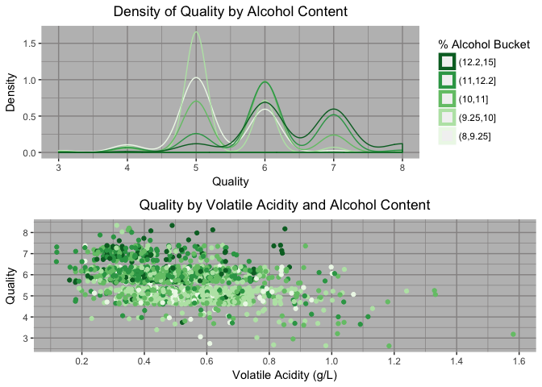

### Description One

A greater proportion of high-alcohol wines have higher quality ratings compared to the proportion of wines in the quality distributions for low-alcohol wines, and a greater proportion of low-alcohol wines have lower quality ratings compared to the proportion of wines in the quality distributions for high-alcohol wines. A much lower proportion of wines have a 3 or 8 rating than the other ratings overall. No wines were rated below 3 or above 8. In addition, higher quality ratings tend to be associated with lower volatile acidity, the exception being some wines in the higher alcohol ranges.

### Plot Two

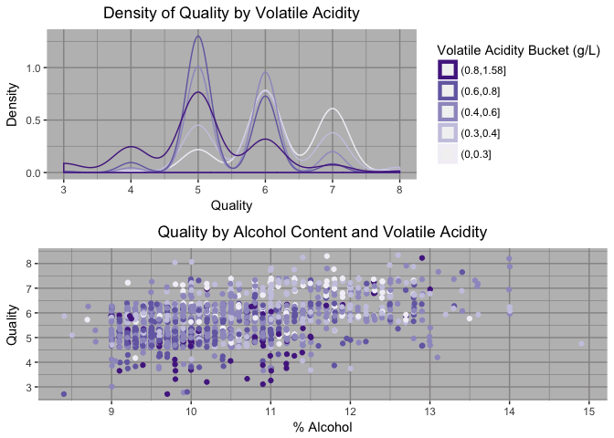

### Description Two

A greater proportion of wines with low volatile acidity have higher qualities compared to the proportion of wines in quality distributions with high volatile acidity, and a greater proportion of wines with high volatile acidity have lower qualities compared to the proportion of wines in quality distributions with low volatile acidity. In addition, this set of plots confirms that high quality ratings tend to be associated with higher alcohol content and low volatile acidity ranges, the exception being some wines with high alcohol content.

### Plot Three

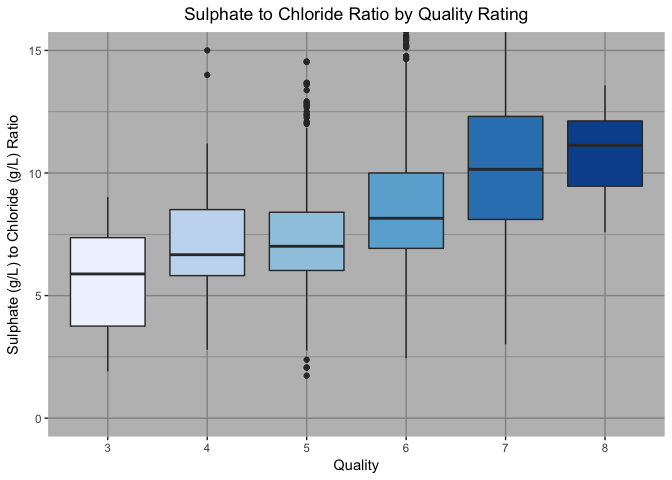

### Description Three

Higher quality ratings are associated with higher sulphate to chloride ratios. It appears to be a somewhat linear, positive relationship when looking at the medians.

------------------------------------------------------------------------

Reflection
==========

This report explores data collected from 1599 red wine samples of the Portuguese Vinho Verde type around 2009. Eleven physiochemical properties were collected from each sample (input variables), along with a median quality rating from wine experts (target feature). I first looked at the distrubution of individual variables to get a better sense of th data. I then took a closer look at pairs of variables that appeared to be correlated, which eventually led me to creating multivariate plots to better explain quality.

Percent alcohol content had the highest correlation with quality, with high quality wines generally being associated with relatively high alcohol percentages. There was also a clear trend between volatile acidity and quality; median volatile acidity decreased with increasing quality ratings. This was not surprising as volatile acidity is the property that can lead to an unpleasant vinegar taste in wine. Interestingly, it appears high alcohol content may be able to compensate for high volatile acidity in some cases. Citric acid and sulphate to chloride ratio are also correlated to quality, but this is a weaker correlation. Both have a positive relationship to quality. Surprisingly, sulfur dioxide content and residual sugar content do not seem to be correlated to quality, at least at the levels in this dataset. These were two features that I assumed would have a greater effect on taste, and therefore the quality rating. A relationship between two of the properties that I still do not understand is that of citric acid vs. volatile acidity. Volatile acidity (acetic acid content) decreases as citric acid content increases, and I was not able to come up with an explanation for this.

I constructed a linear model based on some of these correlations with quality, but my model only accounts for 35% of the variance in quality. My main struggle was coming up with other variables or transformation of variables to account for more of this variance. I think one of the main limitations is that this dataset mostly contains wines of mid-level quality ratings, i.e. there are very few wines with a low (3) or high (8) quality rating, and no wines below 3 or above 8. To investigate this data further, I would try to create a non-linear model to better predict quality, because the linear model I created was clearly ineffective for this particular dataset. A new dataset with a larger sample size with more wines of extreme quality would also help lead to a better predictive model. In addition, it would be interesting if tannins and/or carbon dioxide properties were added as features, since I would assume these would affect perceived quality. From what I read about Vinho Verde wines, many of these wines have a spritz to them from carbon dioxide content, but this was not mentioned in this dataset. These further explorations could lead to a better model for wine quality prediction.
